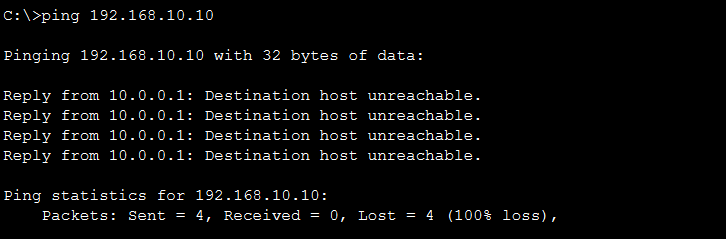
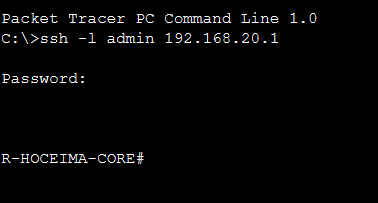

# ✈️ RINAM : Air Navigation Network Security

<p align="center">
  
</p>

<p align="center">
  <b>Architecture réseau sécurisée</b> conçue pour isoler et protéger les flux critiques aéroportuaires (Télémétrie Radar, VCS) contre les intrusions, dans le cadre d'un stage d'initiation au sein d'ONDA — Aéroport Chérif El Idrissi d'Al Hoceima.
</p>

<p align="center">
  
  
  
</p>

---

## 📑 Sommaire

- [Stack Technique](#-stack-technique)
- [Topologie & Segmentation](#-topologie--segmentation)
- [Security Features & Proof of Concept](#-security-features--proof-of-concept)
- [Comment reproduire ce projet](#-comment-reproduire-ce-projet)

---

## 🛠 Stack Technique

| Catégorie | Composants |
|---|---|
| **Infrastructure** | Cisco ISR 4331, Catalyst 2960 |
| **Réseau** | 802.1Q (VLANs), Inter-VLAN Routing (Router-on-a-stick) |
| **Sécurité** | ACLs étendues (Stateless Firewalling), SSHv2 (RSA 1024-bit), IOS Hardening |
| **Outil de simulation** | Cisco Packet Tracer |

---

## 🗺 Topologie & Segmentation

Le réseau est divisé en **3 zones isolées** selon une approche Zero-Trust :

| Zone | Réseau | Description |
|---|---|---|
| 🔴 **VLAN 10 — CRITICAL** | `192.168.10.0/24` | Systèmes Radar |
| 🟡 **VLAN 20 — MANAGEMENT** | `192.168.20.0/24` | Administration & Syslog |
| ⚪ **WAN — UNTRUSTED** | `10.0.0.0/8` | Simulation d'attaques externes |

<p align="center">
  
  <br/><sub><i>Isolation niveau 2 sur le switch d'accès</i></sub>
</p>

<p align="center">
  
  <br/><sub><i>Routage inter-VLAN sur le routeur de bordure</i></sub>
</p>

---

## 🔐 Security Features & Proof of Concept

### 1. Perimeter Firewalling (ACLs)

Mise en place d'une règle **"Default Deny"** depuis la zone Untrusted vers le sous-réseau critique (VLAN 10).

Les tentatives d'accès (ex : ICMP) sont strictement bloquées par l'interface externe du routeur :

<p align="center">
  
  <br/><sub><i>Ping refusé depuis le poste attaquant simulé</i></sub>
</p>

Vérification des paquets rejetés (*matches*) directement dans la table de l'ACL :

<p align="center">
  
  <br/><sub><i>Compteurs de correspondance sur le routeur</i></sub>
</p>

### 2. Secure Remote Administration (SSHv2)

Accès distant au routeur restreint exclusivement au protocole **SSHv2** (Telnet désactivé), avec chiffrement RSA 1024-bit, pour sécuriser toute session d'administration depuis le poste de management (VLAN 20) :

<p align="center">
  
  <br/><sub><i>Session SSH établie depuis le poste d'administration</i></sub>
</p>

---

## ⚙️ Comment reproduire ce projet

Si tu veux reproduire cette architecture sur Cisco Packet Tracer, voici les grandes étapes :

### Prérequis
- [Cisco Packet Tracer](https://www.netacad.com/courses/packet-tracer) installé (version 8.x recommandée)
- Connaissances de base : VLAN, routage inter-VLAN, ACL, SSH

### Étapes

1. **Créer la topologie**
   - Ajouter 1 routeur `Cisco ISR 4331` et 1 switch `Catalyst 2960`
   - Ajouter les PC/serveurs représentant les systèmes Radar (VLAN 10), le poste d'administration (VLAN 20), et un poste "attaquant" côté WAN

2. **Configurer les VLANs sur le switch**
   ```
   enable
   configure terminal
   vlan 10
    name CRITICAL
   vlan 20
    name MANAGEMENT
   interface range fa0/1 - 2
    switchport mode access
    switchport access vlan 10
   interface range fa0/3 - 4
    switchport mode access
    switchport access vlan 20
   ```

3. **Configurer le routage inter-VLAN (Router-on-a-stick)**
   ```
   interface gig0/0.10
    encapsulation dot1Q 10
    ip address 192.168.10.1 255.255.255.0
   interface gig0/0.20
    encapsulation dot1Q 20
    ip address 192.168.20.1 255.255.255.0
   ```

4. **Appliquer les ACLs de sécurité (Default Deny)**
   ```
   access-list 110 deny icmp any 192.168.10.0 0.0.0.255
   access-list 110 permit ip any any
   interface gig0/0/0
    ip access-group 110 in
   ```

5. **Durcir l'accès administratif (SSHv2)**
   ```
   ip domain-name rinam.local
   crypto key generate rsa
   (choisir 1024 bits)
   line vty 0 4
    transport input ssh
    login local
   ```

6. **Tester**
   - Depuis le poste attaquant (WAN) : tenter un `ping` vers `192.168.10.x` → doit être **bloqué**
   - Vérifier les compteurs avec `show access-lists`
   - Tester une connexion SSH légitime depuis le poste de management (`SSH-PC-Admin.png`)

---
